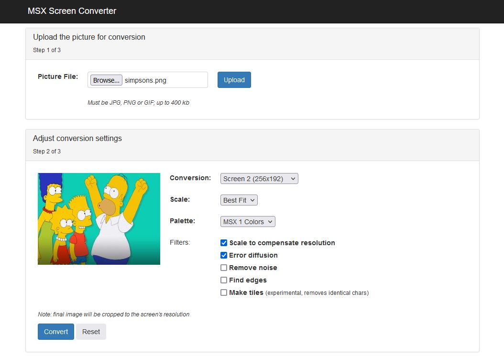
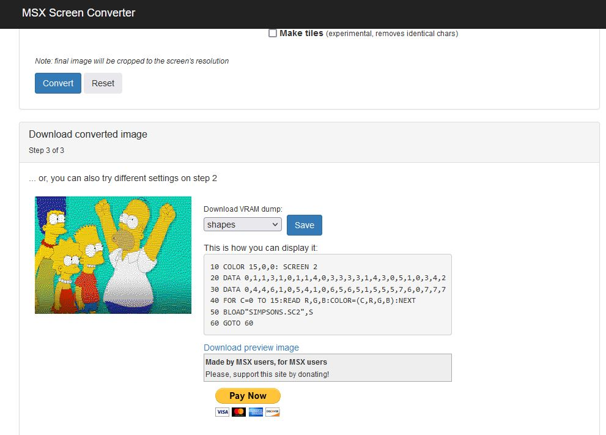
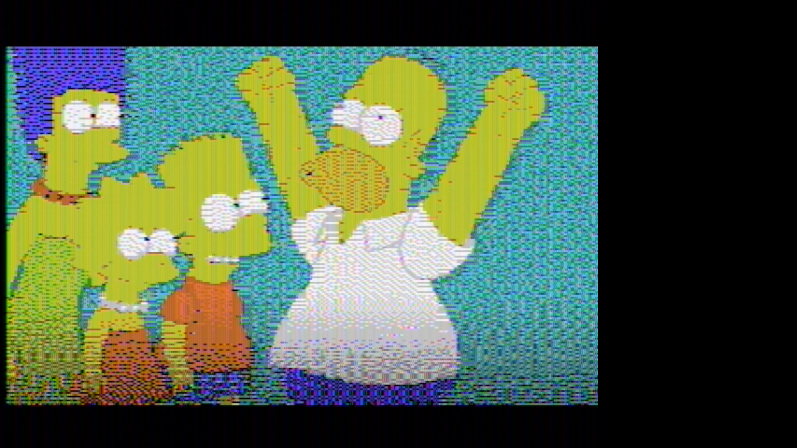

# TMS9918 Example
This example shows a Bitmap on the TMS9918

## Create Own Bitmaps
- Upload an image to the [MSX Screen Converter](https://msx.jannone.org/conv/)
- Select Conversion: "Screen2 (256x192)" and Palette: "MSX1 Colors" 
- click "Convert"   
- Play with the conversion settings until it looks best 
  
- Download the VRAM dumps:
  - Shapes: Save as `.pat` file, i.e. `simpsons.pat` 
  - Attributes: Save as `.col` file, i.e. `simpsons.col`
- Change the filenames after the "incbin" directives at the end of [tms9918.asm](tms9918.asm)
- Type `make` to assemble

Congrats if you see this:

