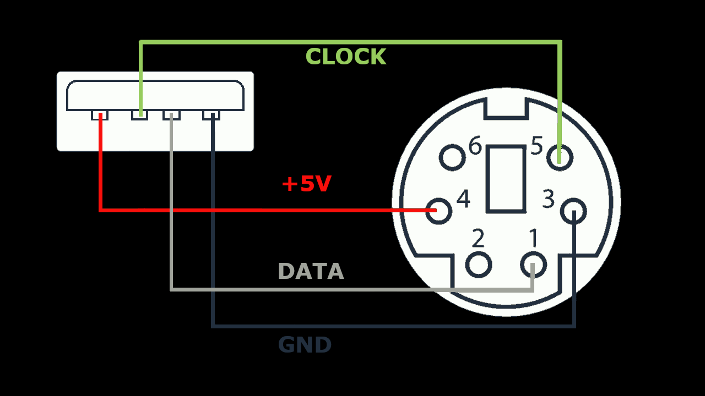

# ZX 2022
Yet another homebuilt Z80 Computer, but this one works without any FPGAs or Microcontrollers, but components that were available at the time when the Z80 processor was state of the art. It can run historic CP/M programs like Multiplan, Wordstar and MBasic, as well as some games. This is a reminiscense to the Sinclair ZX81 computer. 
In contrast to its predecessor, the ZX2020, this one uses a 32 kilobyte EE Prom to reliably store the CP/M BDOS and BIOS. Furthermore a PS/2, or  PS/2 compatible USB keyboard can be connected. With an optional TMS99x8 based video card, a  TV or monitor can also be used. This repository contains gerber files for both the ZX2022 and the video  card. So it can now be easily replicated.

## Features
- Zilog Z80 processor @6MHz, higher clock rates might also work.
- 128 Kilobytes of static RAM, can be switched in banks of 32k
- 32 Kilobytes of EEprom
- 2 Serial UART ports 187.5 kBaud (Clock freqency/32):
  - Terminal emulation, (Putty works best)
  - File transfer. Files in a special folder on the PC show up as drive B>
- EEprom provides 15 Kilobytes of file memory (drive A>). CP/M executables are started automatically after reset or power on
- IDE (PATA) interface. Provides 4x16 Kilobyte organized as drives C>..F>
- CP/M 3.0
- 64-Pin connector for up to 6 Extension modules
- Optional graphics card with TMS99x8. 
    - 256x192 pixels and 15 colors
    - 32 Sprites (8x8, 16x16 or 32x32 upscaled)
    - NTSC (TMS9918) or PAL (TMS9928)
- Supports PS/2 or PS/2 compatible USB keyboards. New USB keyboards or wireless keyboards may NOT work.

## To build the ZX 2022, do the following
- Wire the parts on a breadboard or prototype board according to the schematic. 
- OR: Make or order a PCB based on the gerber files `./Schematic/Mainboard/gerber.zip` (Recommended)
- Load the Arduino Sketch `loader/loader.ino` into an Arduino Mega
- Plug the Arduino Mega on the Bus connector, where it is marked on the silkscreen
- Connect the TxB and RxB pins of the DART with Pin 0 (TX0) and 1 (RX0) of your Arduino Mega
- Start a serial terminal emulation, for example "Putty", set 187500 Baud, 8 Bit, 1 Stopbit, no parity
- On Windows, run the tool `bin/loader.exe`. Click on "ROM Image" and select the file `CPM/rom.img`
- When a welcome message and the CP/M prompt "B>" appears on your terminal emulation, the ZX2020 is ready to use. If you have a PATA compatible hard drive connected, you need to format it under CP/M with the "mkdsk.com" tool before you can use it. Note that all data on the disk will be lost. 

## Using The Serial Disk Drive
Connect RX0 of the Arduino with TxB and TX0 with RxB of the ZX2022. 
It is not necessary to plug the Arduino into the pin header. Instead of an Arduino, a USB to serial converter may be used here as well. Select the serial port in the drop down menu and check the "Connect" check box to establish the serial connection. After a reset, the serial disk drive can be accessed as drive B>.

The folder [CPM/serdisk](./CPM/serdisk/) contains the CP/M programs in up to 16 user folders numbered from 0 to 15. If any of these files have changed, click the "Reload" Button to apply the changes. To access the files from CP/M, type `B`, followed by the user number 1-15 and a colon. For example `B5:` gives access to the files under [CPM/serdisk/5](./CPM/serdisk/5)

## The Autostart Feature
Clicking the `File` button in the loader app uploads an executable CP/M file (*.com) that is executed after each power-on or reboot. The loader app detects when there is a new version of this "autostart program" and restarts the ZX2022 with this new version. This function is particularly useful for writing new software.

## Connecting a PS/2 Keyboard
Connect a PS/2 Keyboard like shown below:

## Connecting a USB Keyboard
USB Keyboards can also be connected if they support the PS/2 protocol. Most older keyboards do so, but newer or wireless keyboards often don't. These will not work.
I recommend to make an adapter cable from an USB extension cable as shown below:

## Changing the keyboard layout 
This is only necessary with PS/2 or USB keyboards. With terminal connections, the settings of the Windows-OS apply.
To change the keyboard layout, set the `KBLAYOUT` variable in the file [CPM/SYSCFG.LIB](./CPM/SYSCFG.LIB) either to `DE` or `EN` (default)
and [rebuild the CP/M rom image](CPM/README.md).

## Using With the TMS9918 Video Card
You find the schematic and gerber files in [Schematic/Video/](./Schematic/Video/). Set a jumper or solder a bridge at the position `IO2` on the pin header J3. This configures the card for IO addresses starting at 20h. This setting must match the `p$vdp` constant in [CPM/SYSCFG.LIB](./CPM/SYSCFG.LIB)

The TMS9918 can only display 40 columns, while terminals display 80 columns. This CP/M version is built for 80 columns, but it can be changed to 40 columns. To do this, open the file [gencpm.dat](./CPM/gencpm.dat), change the constant `PAGWID` to 28 (Which is 40 in hex) and [rebuild the CP/M rom image](CPM/README.md).
